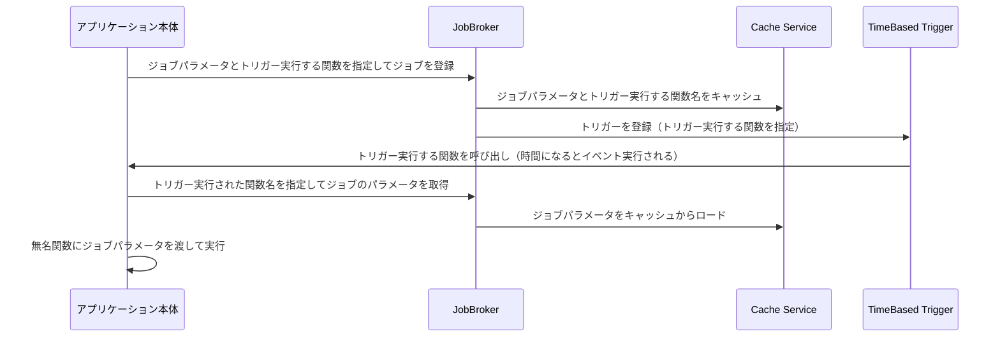
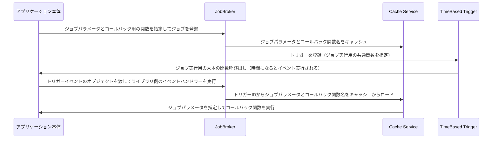

## はじめに

以前こんなGASライブラリを実装していたのですが、その当時では表題の件をうまく実装できていませんでした。

https://zenn.dev/katzumi/articles/58354fb4d05038

かなりニッチなケースだとは思いますが、記事にしたいと思います。

## やりたかったこと

https://github.com/k2tzumi/apps-script-jobqueue

こちらのGASライブラリはGASで非同期処理を実現するものです。
以前の処理フローはこちらの様になっていました。



簡易的なジョブキューなシステムで非同期実行をするという点においては実現できていたのですが、イマイチでした。 ^[ジョブパラメータをコールバック関数に直接渡すことが出来ませんでした]
これを以下のようなフローにしたいと考えました。



最後のGASライブラリ側からアプリケーション本体のグローバル関数を呼び出す様にしたかったのです。

## グローバル関数を動的にコールバックさせるには？

上記のフローでありますが、キャッシュされたコールバック用の関数名（文字列）から動的にコールバックさせる必要があります。
javascriptで動的に関数を呼び出す方法は

* eval関数を使う
* Functionコンストラクタを使う
* windowオブジェクトを使う

上記などがあります。
ただ今回はGASになりこちらに上げた方法では使えませんでした。  
セキュリティの面でevalは論外として、google apps scriptではグローバルスコープにある変数や関数にアクセスするにはwindowsオブジェクトではなく、globalThisは使えそうでした。

## GASライブラリ内のglobalThisのスコープについて

結論からいうと、globalThisはGASのライブラリ内ではそのままでは使えませんでした。  
原因はGASライブラリ内のglobalThisのスコープはアプリケーション側のスコープと独立している為です。  
オフィシャルに変数のスコープ等についての制約を明記したドキュメントを見つけることは出来ませんでしたが、セキュリティ的にライブラリ側からアクセスできるとアレなので仕方ないと思います。  

ライブラリ側からアプリケーション側のグローバル関数へのアクセスがそのままでは出来ないという壁にぶつかりました。

## 参照できないなら渡してしまえ

globalThisが独立しているので、グローバルで定義された関数オブジェクトが参照できませんでした。  
ライブラリとしては関数オブジェクトが欲しいだけなのにーと頭を抱えてしまいましたが、力技でなんとかすることにしました。

* アプリケーション側
    ```ts
    function jobEventHandler(event: TimeBasedEvent): void {
        JobBroker.consumeJob(event, globalThis);
    }
    ```

* ライブラリ側
    ```ts
    public consumeJob(event: TimeBasedEvent, global: typeof globalThis): void {

        // .. snip ..

        // 関数オブジェクト取得
        const handler = global[parameter.handler];
        if (handler === undefined || typeof handler !== "function") {
            throw new TypeError();
        }

        // 関数をコールバック実行
        const result = handler(JSON.parse(parameter.parameter));
    }
    ```

アプリケーション側のglobalThisを渡すので引数が一つ増えてしまいましたが、まあ許容範囲かなーと思いました。

## 最後に

ライブラリの型定義情報も更新しています。  
今回Genericに対してジョブパラメータを型安全に利用できるようにしました。  
またコールバック関数の戻り値には真偽値を返せるようになりました。これはジョブ実行後のトリガー実行のステータスを制御できるようにする為で、ジョブが失敗した場合にログを確認しやすくする為のものです。