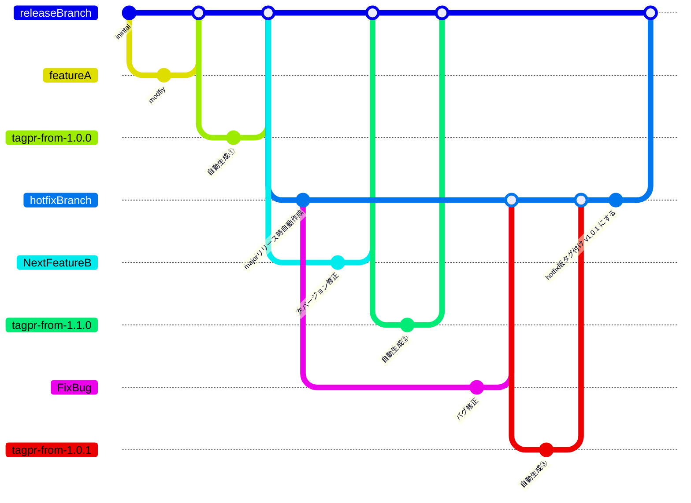

## はじめに

tagprが100 stars超えされていました。おめでとうございます！

https://twitter.com/songmu/status/1587001199207018496

tagprはとあるOSSのリポジトリで導入され、体験する機会を得ました。
その際に開発者体験が頗る良くて感動し、今携わっているBaaSの開発プロジェクトに導入したお話をまとめたいと思います。 

OSS開発でのtagprの使用感については [@k1LoW](https://twitter.com/k1low) さんがまとめてくれています。
https://k1low.hatenablog.com/entry/2022/10/04/083000

## 導入したプロジェクトについて

スキーマ駆動開発で進めているBaaSで、複数クライアント（サービス）から利用されます。  
現時点では外部公開してはおらず限定的な接続元にはなりますが、複数の組織が管理するサービスからアクセスしてもらうことを想定しています。
システム自体はマルチテナント型で開発を進めていますが、扱うデータの特性と各クライアントのサービスの特性からシングルユースでの稼働をベースにしています。

* 接続するクライアント向けにスキーマ（OpenAPI Spec）を先行公開し、並行開発する
* 複数環境で複数バージョンが稼働する  
各クライアント毎に提供する機能が異なるわけではないですが、クライアントとバージョンアップのタイミングを合わせる必要があり、完全にバージョンを統一できない　^[何処かのタイミングでは統一がされます]
* 機能追加には必ずQAが入る想定で、リリース間隔も月単位と比較的に長い

上記特性があり、通常のWebサービスやOSSの開発サイクルとは異なるかと思います。

## tagprで解決したかったこと

* 複数クライアント（サービス）と並行開発するのでAPIのバージョンの明確化したい
普段の開発サイクルでも細かくリリース管理をしてお互いに認識するバージョンの齟齬をなくしたい
* 他部署の開発者へのAPIの変更有無及びその内容を確実に伝えたい
* チーム内でリリースタイミングでのmigrationの統合やI/F変更の調整を行いたい

上記が課題感としてありました。  
またこれらを実現しようとした場合に細かくリリース管理を行う必要がありますが、開発負荷が高くなる懸念がありました。  
他のプロジェクトでは、本番リリース前だけtag付けのみを行うリリースフローで運用されておりtag付けを行ったメンバーも限られていました。  

## tagpr導入前までの開発イメージ

開発環境への反映ですが、とあるタイミングでmainブランチの commit idでリリースをしていました。
リリース内容の全体把握が出来ているのは自分のみだったので、私一人で作業を行っていました。
気分次第でリリースしたり、しなかったりという感じでした。  
他チームへの共有ですが、APIの変更点もリリース前に事前にだけして、リリース後のアナウンスは忘れていたりもしました。
また開発環境はdeployスクリプトが整備されておらず、migrationの適用漏れが発生するケースもありました。

1stリリース前の開発段階ということもあり、リリースフローが定まっていない状況でした。

## tagpr導入後の開発手順

まだ試行錯誤の部分もありますが、tagpr後は以下の運用ルールとしました。

* 開発環境へのリリースは、かならずリリースPRをmergeしてから行うフローとする
* リリース後は各チームにReleaseノートのURLを共有する
* OpenAPIのSpecに記載するバージョンを連動させる用にtagprへ設定を入れる
* Breaking ChangesなAPIの変更があるPRはminorラベルをつける
* ReleaseノートにAPIの変更点を追記する
* migrationやライブラリアップデートがあるPRはminoラベルをつける
* 本番リリース時にはmajorラベルをつける（予定）

あと細かい所ですが、リリース作業と共有はpatchとpatch以外とでフローを分けるようにしました。

## tagpr導入で実現できたこと

1. 他部署とのバージョン共有はReleaseノートのURLを共有するだけで良くなった  
1. 環境毎にどの時点でのバージョンが反映されているか？わかりやすくなった
1. 開発環境以降のリリース作業を各サービスの開発担当者へ任せられるようになった
1. OpenAPI SpecのI/F上のバージョンと検証時のバージョンの整合性を把握できる様になった
1. リリースの一連の作業をメンバーに任せられるようになった

これらのことが、それほど運用負荷をかけずに実現できました。

1についてはtagprが自動でPRの一覧をReleaseノートにまとめてくれるのでAPIの変更点がなければ手を入れずに共有するだけで済みます。本当に楽でありがたいです！
少し要望を上げるならば、PRについていたラベルも一緒にReleaseノートへ出力できると他の開発者の関心がありそうなPRを把握しやすくて良さそうと思いました。^[BugfixやBreaking Changesを確認しやすくなると嬉しいです。Releaseノートを修正する際にピックアップしやすくて良さそう]

2〜4についてはスキーマ駆動開発で並行開発をしていく中で、安心感が全然違うと感じました。これは対外でだけでなく、チーム内でも今どのバージョンが反映されていて、次に何をリリースするのか？というのが明確になるのが大きいと感じています。
Releaseノートだけでなく、リリースPR自体を次のバージョンアップの予告に使える様になったのも個人的に嬉しかったです。
あとリリースPRの変更点が積み上がってくると、早めにリリースしようという気にもなってきますｗ

最後の5についてですが、リリースフローが明確になって簡単に誰でもリリースができる様になったのが大きいです。機能毎にチーム分けして開発していると、全体を把握しているリーダーが細々したリリースの段取りだったり調整を行うことが多い印象でしたが、リリース内容を全員が把握しやすくなったので細かい指示を出さなくても自主的に調整を行える様になったと思います。  
開発の初期段階では頻繁にmigrationの見直しが入りますが、リリース前であればmigrationを統合させるといったこともメンバー主導で行うことができる様になります。
リリース全体のマネジメントコストが下げられて、一人でリリースのお守りしていた負担 ^[主に脳内リソース]が分散されて心理的な負担も軽くなったと感じました。

## 今後の課題について

導入したプロジェクトですが、まだ絶賛開発中で1stリリースを迎えていないです。
リリースマネジメントとしてはこれからが本番となります。
これから発生するであろう以下のユースケースをどうするか？については検討中です。

1. QAテストが完了した後にリリース(major)のバージョンを上げる
1. 本番リリース後のHotfixリリース

今のプロジェクト的にはminorとpatchは開発バージョン、majorはリリースバージョンとして扱うのが良さそうだと考えています。
minorをどんどん上げていき、クライアントとの連携も確認ができたらリリースとしたいです。リリース前にはQAテストが入るのでそれが終わったらmajorバージョンを上げたいです。
現状のtagprでは `releaseBranch` に変更がないとリリースPRが作られない為、手動でリリースPRを作るか？リリースPRを作成するコミットを入れる感じになりそうです。
tagprのGitHub Actionsを `workflow_dispatch` からバージョン指定してリリースPRが生成できると、一手間省けて良さそうです。

2のユースケースついては、色々悩ましいです。
リリース後に開発（`releaseBranch`）が進んでいるケースがあるので。。
`releaseBranch` に既に反映されているものがpatchレベルなら、通常通りに修正PRをmergeしてバージョンを上げてしまえばよいのですが、 minorが上がってしまっている場合は別フローを考えないといけません。
tagpr外のフローでバージョン管理をしてしまえば良いと思うのですが、デプロイ周りのCIフローをtagprと連動させる形で構築している場合にはもう少し考える必要がありそうです。
HotfixのPR自体をtagprのリリースPRの形式に合わせて作成してあげれば良さそうですが、まだ検証できていません。
理想ですが、Hotfix用のリリースブランチにmergeされたらcommitツリー上の直近のmajorバージョンに対してリリースが切れる様になるといいのですが。。
以下は完全に妄想なブランチワークとなります。

もっと良いアイデアがあれば、アドバイスを頂けると大変助かります mm

## 最後に

OSS外でtagprを導入してみましたが、十分メリットを感じることができました。
是非皆さんにも一度体験をしてみて頂きたいと
まだ手探りな部分があるので、いい感じに開発サイクルに組み込んでいきたいと思います。

