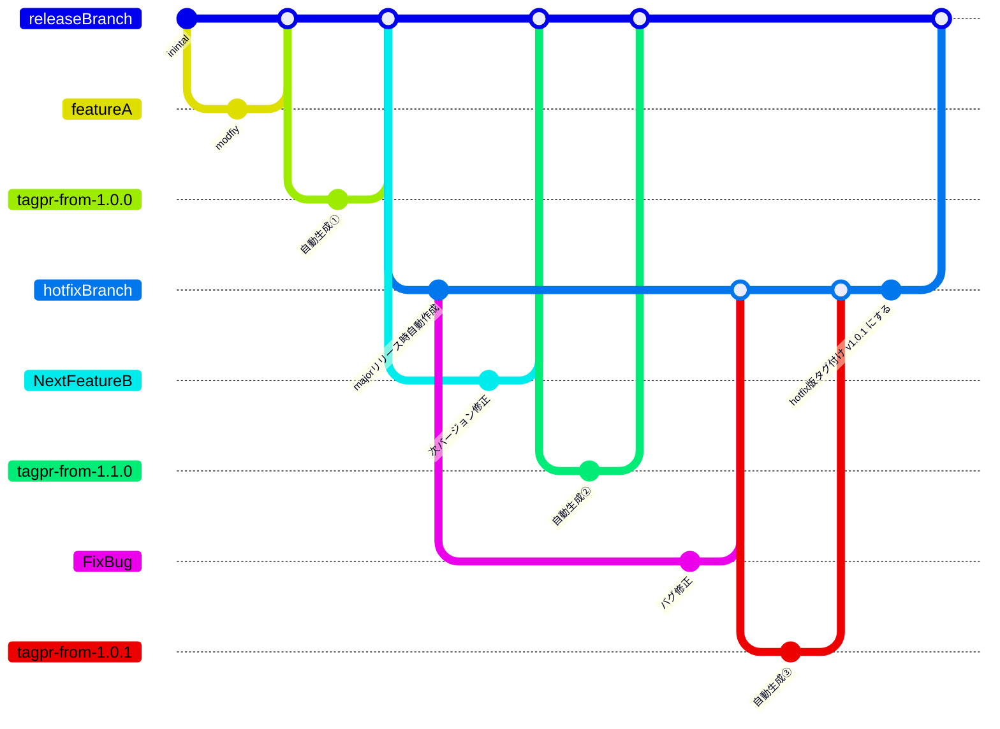

## はじめに

tagpr が 100 stars 超えされていました。おめでとうございます！

https://twitter.com/songmu/status/1587001199207018496

tagpr は、とある OSS のリポジトリで導入されて体験する機会がありました。
開発者体験が頗る良く感動し、今絶賛開発中の BaaS の開発プロジェクトに導入した件についてまとめたいと思います。 

tagpr を知るきっかけを作って頂いた OSS 開発での内容については [@k1LoW](https://twitter.com/k1low) さんがまとめてくれています。
https://k1low.hatenablog.com/entry/2022/10/04/083000

## 導入したプロジェクトについて

スキーマ駆動開発を採用している BaaS プロジェクトになります。 ^[こちらのプロジェクトでのスキーマ駆動開発のフローについて[紹介記事](https://zenn.dev/katzumi/articles/schema-driven-development-flow)をまとめていますので良かったら是非見てみてください]
こちらのサービスが提供する API は複数クライアント（サービス）から利用されます。  
複数の組織が管理するサービスからアクセスしてもらうことを想定しています。
マルチテナントなサービスとして開発を進めていますが、扱うデータと各クライアントのサービスの特性から複数環境にリリースを行います。

ざっくり纏めると以下の様になると思います。

* BaaS の接続クライアント向けにスキーマ（OpenAPI Spec）を先行公開して並行開発する
* 複数環境に複数のバージョンが稼働する  
各サービス毎に提供する API は同じですが、クライアントとバージョンアップのタイミングを合わせる必要があり、完全にバージョンを統一できない　^[何処かのタイミングでは統一がされます]
* リリース前には必ず QA テストを実施し、リリースサイクルは比較的長く月単位

バージョニングが必要なプロジェクトになりますが、QA テストが入る点と、リリースサイクルが長いのが特徴的でしょうか。

## バージョニングにおける課題感

以下の課題感がありました。

* 複数クライアント（サービス）と並行開発するので API のバージョンを明確化したい
普段の開発サイクルでも細かくバージョニングして関連するチーム間での認識するバージョンの齟齬をなくしたい
* 他部署の開発者への API の変更有無及びその内容を確実に伝えたい
* チーム開発環境 -> QA 環境 -> 本番環境と統一したリリースフローを作りたい
deploy タイミングでバージョンの不整合を防ぎたい
* チーム内でリリースタイミングでの migration の統合や I/F 変更の調整を行いたい

上記の課題に対しては細かくバージョニングを行う必要がありますが、開発負荷が高くなる懸念がありました。  

## tagpr導入前までの開発イメージ

他のプロジェクトでは、本番リリース前だけ tag 付けのみを行うリリースフローで運用されていました。

* 本番環境以外への deploy は develop ブランチをリリースするだけ
* tag 付け作業を行うメンバーも限られていた

バージョンの齟齬が発生しやすい開発フローでした。

BaaS の開発をスタートしてからも、上記と同じくチーム開発環境へのリリースは develop ブランチのみで行っていました。
リリース内容の全体把握が出来ているのは自分のみだったので、一人で作業を行っており、気分次第でリリースしたり、しなかったりという感じです。  

リリース時の各クライアントのチーム向けへの共有ですが

* API の変更点をリリース前に事前告知のみ
* 細かい内容までは伝え漏れている
* そもそもリリース後のアナウンスが忘れられていたり

といった状況でした。

また開発段階で deplooy スクリプトの整備が追いついていなかったりで、migration の適用漏れも発生していたりしました。

## tagpr導入後の開発手順

まだ試行錯誤の部分もありますが、tagpr 後は以下の運用ルールとしました。

* 開発環境へのリリースは、かならずリリース PR を merge してから行うフローとする
* リリース後は各チームに Release ノートの URL を共有する
* OpenAPI の Spec に記載するバージョンを連動させる用に tagpr へ設定を入れる
* Breaking Changes な API の変更がある PR は minor ラベルをつける
* Release ノートに API の変更点を追記する
* migration やライブラリアップデートがある PR は mino ラベルをつける
* 本番リリース時には major ラベルをつける（予定）

あと細かい所ですが、リリース作業手順をまとめてチーム内外への共有を行いました。
作業手順と各クライアントのチームへの共有ルールは patch バージョンとそれ以外とでフローを分けるようにしました。

## tagpr導入で実現できたこと

1. バージョンアップの共有は Release ノートの URL を共有するだけで良くなった  
1. 環境毎にどの時点でのバージョンが反映されているか？わかりやすくなった
1. 開発環境以降のリリース作業を各サービスの開発担当者へ任せられるようになった
1. OpenAPI Spec の I/F 上のバージョンと検証時のバージョンの整合性を把握できる様になった
1. リリースの一連の作業をメンバーに任せられるようになった

これらのことが、それほど運用負荷をかけずに実現できました。

1 については tagpr が自動で PR の一覧を Release ノートにまとめてくれるので API の変更点がなければ手を入れずに共有するだけで済みます。本当に楽でありがたいです！
少し要望を上げるならば、PR についていたラベルも一緒に Release ノートへ出力できると他の開発者の関心がありそうな PR を把握しやすくて良さそうと思いました。^[BugfixやBreaking Changesを確認しやすくなったり、Releaseノートを纏める際にもピックアップしやすくなると嬉しいです。]

2〜4 についてはスキーマ駆動開発で並行開発をしていく中で、安心感が全然違うと感じました。これは対外でだけでなく、チーム内でも今どのバージョンが反映されていて、次に何をリリースするのか？というのが明確になるのが大きいと感じています。
個人的には Release ノートだけでなく、リリース PR 自体を次のバージョンアップの予告に使える様になったのも嬉しかったです。
あとリリース PR の変更点が積み上がってくると、早めにリリースしようという気にもなってきますｗ

最後の 5 についてですが、リリースフローが明確になって簡単に誰でもリリースができる様になったのが大きいです。機能毎にチーム分けして開発していると、全体を把握しているリーダーが細々したリリースの段取りだったり調整を行うことが多い印象でしたが、リリース内容を全員が把握しやすくなったので細かい指示を出さなくても自主的に調整を行える様になったと思います。  
開発の初期段階では頻繁に migration の見直しが入りますが、リリース前であれば migration を統合させるといったこともメンバー主導で行うことができる様になります。
リリース全体のマネジメントコストが下げられて、一人でリリースのお守りしていた負担 ^[主に脳内リソース]が分散されて心理的な負担も軽くなったと感じました。

## 今後の課題について

導入したプロジェクトですが、まだ絶賛開発中で 1st リリースはこれからとなります。
これから発生するであろう以下のユースケースをどうするか？については検討中です。

1. QA テストが完了した後にリリース(major)のバージョンを上げる
1. 本番リリース後の Hotfix リリース

プロジェクト的には minor と patch は開発バージョン、major はリリースバージョンとして扱うのが良さそうだと考えています。
普段は patch や minor のバージョンアップを繰り返し、QA テストが完了してリリースが ready になったら major バージョンを上げたいです。
現状の tagpr では `releaseBranch` に変更がないとリリース PR が作られない為、手動でリリース PR を作るか？リリース PR を作成するコミットを入れる感じになりそうです。
tagpr の GitHub Actions を `workflow_dispatch` からバージョン指定してリリース PR が生成できると、一手間省けて良さそうです。

2 のユースケースついては、色々悩ましいです。
リリース後に開発（`releaseBranch`）が進んでいるケースがあるので。。
`releaseBranch` に既に反映されているものが patch レベルなら、通常通りに修正 PR を merge してバージョンを上げてしまえばよいのですが、 minor が上がってしまっている場合は別フローを考えないといけません。
tagpr 外のフローでバージョン管理をしてしまえば良いと思うのですが、デプロイ周りの CI フローを tagpr と連動させる形で構築している場合にはもう少し考える必要がありそうです。
Hotfix の PR 自体を tagpr のリリース PR の形式に合わせて作成してあげれば良さそうですが、まだ検証できていません。
理想ですが、Hotfix 用のリリースブランチに merge されたら commit ツリー上の直近の major バージョンに対してリリースが切れる様になるといいのですが。。
以下は完全に妄想なブランチワークとなります。

もっと良いアイデアがあれば、アドバイスを頂けると大変助かります mm

## 最後に

スキーマ駆動開発のバージョニングを行うには tagpr はすごいマッチすると思います。
実際に導入してみて本当に心地よいリリースマネジメントが出来るようになったと感じています。
tagpr がなかったら細かくバージョニングを行うというマインドにはならなかったと思います。

tagpr はツールですが、リリースの運用もスッキリし、プロジェクトの文化にも良い影響を与えてくれるのでは？と期待しています。

まだまだ手探りな部分がありますが、プロジェクトに沿ったいい感じになる様に開発サイクルに組み込んでいきたいと思います。

