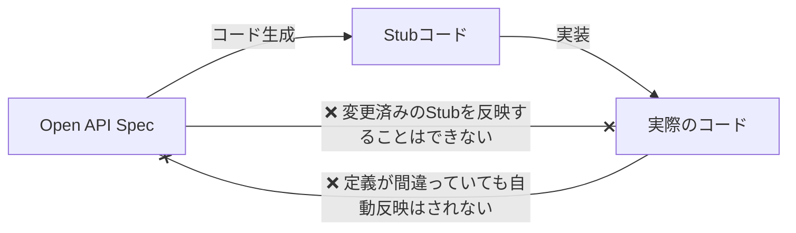
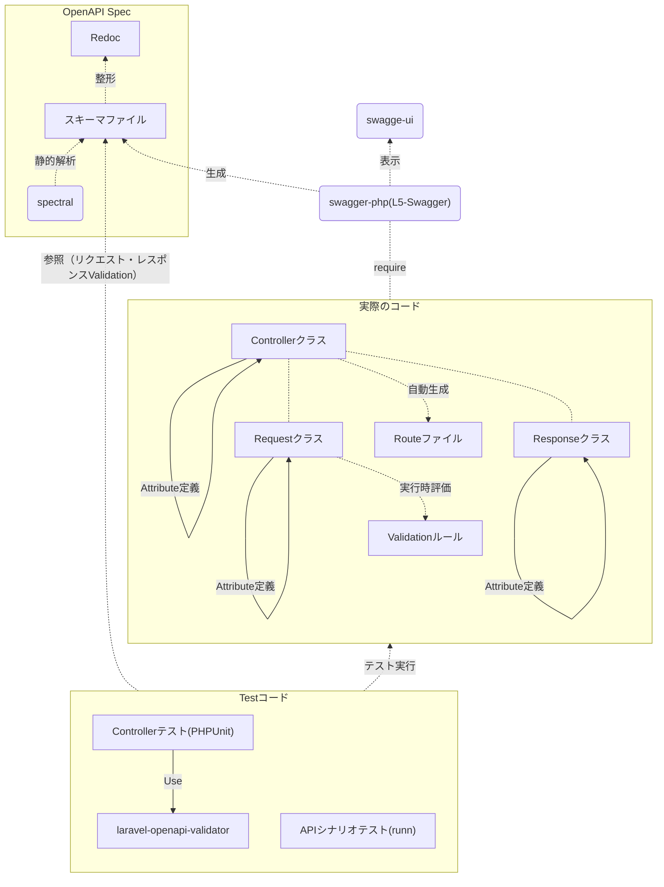

## はじめに

スキーマ駆動開発のフローは関連するツールの組み合わせだったり、APIを作成する際の開発手順は様々だと思います。  
今回取り上げたいテーマとしてOpenAPIでAPI仕様書を定義し、そのAPIをLaravelで実装する開発フローを中心に話をしたいと思います。  

## 記事で扱う内容

* バックエンドのAPI実装〜テスト方法について
* OpenAPI v3(REST API)でのスキーマ駆動開発
* クリーンアーキテクチャを採用したLaravelでのWebAPI開発

## 触れない内容

* APIのクライアント側の実装  
バックエンドのAPIをどの様に実装していくか？についてフォーカスしています
* OpenAPI自体の説明と書き方
* 具体的な実装コード  
肝となるコードとサンプルは記載しますが、開発を円滑に行う為のコードはプロジェクト固有な点が多いので記事では触れません
* 利用する各ツールのインストール手順やセットアップ方法  
リンクを明示してありますので、各README等を参照ください

## スキーマ駆動開発における課題認識

ある程度の規模感、複雑さを持ったシステム開発に対してスキーマ駆動開発を行っていくと、以下の2つの問題が出てくると考えています。  

1. スキーマファイルが大きくなりすぎて辛い
2. スキーマ定義と実際の実装が乖離してしまう


1については、スキーマファイルを分割して管理し実際にツールで利用する際に結合して回避する方法がありますが、それでも結構大変です。  
OpenAPI V3ではRequest bodyをschemaとして定義できますが、 `$ref` で参照させるなど、生のフォーマットを理解してレビューするのは大変です。  
2については、スキーマファイルからコード生成させるアプローチがありますが、自動生成するコードがスケルトンになるだけで手直ししないと使えません。  
一度スキーマ通り実装ができた後に、スキーマ変更をする際にどうしても乖離が発生しがちです。  

コードの自動作成のツールに [openapi-generator](https://github.com/OpenAPITools/openapi-generator) が有名どころでLaravelのサポートも一応あるのですが、クリーンアーキテクチャを採用したLaravelプロジェクトにはマッチしませんでした。  
ディレクトリ構成の自由度がなかったり、リクエストクラスとレスポンスクラスの自動生成までは行ってくれなくてマッチしませんでした。  

## 課題の根本原因はスキーマとコードとの距離が離れてしまっている点

前述の課題の原因を深堀りすると、スキーマとコードとの距離が離れてしまっているのが根本原因にあるのでは？と考えています。  
スキーマ通りにコードが実装されているか？を確認するのにスキーマとコードがそれぞれ独立したものとして存在すると、スキーマとコードのマッピングしながら行わないといけません。  
このマッピングが大変でレビューでも難儀します。  
APIの数が多かったり、リクエストやレスポンスが複雑だったりしたら、複数のファイルをいったりきたりしながら桁数誤りを見つける作業はサイゼリヤの間違い探しよりも難解ですw  

自動生成系のアプローチも情報が一方通行になっていれば良いのですが、全てが生成されるわけではなく手を加える必要があり



上記フローになり反映ができない箇所によってどうしても乖離がでてしまってイマイチです。

## スキーマとコードの距離を近づける方法

スキーマ定義をコードに埋め込むのが良いと考えています。  
どうやるか？ですが、 [swagger-php](https://github.com/zircote/swagger-php) を利用します。
swagger-phpはannotationかAttributeでspecを記載できます。  
今回はよりコードに近づけて記述できるようにAttributeを採用します。  
AttributeはPHP8.1から追加された言語機能になり、以下の様な記述になります。　　

[オフィシャルドキュメント](https://zircote.github.io/swagger-php/#_2-update-your-code) より転載

```php
<?php

use OpenApi\Attributes as OA;

#[OA\Info(title: "My First API", version: "0.1")]
class OpenApi {}

class MyController {

    #[OA\Get(path: '/api/data.json')]
    #[OA\Response(response: '200', description: 'The data')]
    public function getResource() {
        // ...
    }
}
```

Attributeで記述することにより、IDEのサポートを受けれたり、後述するコードとしても活用できるメリットが出てきたりします。
APIを構成する

* Controllerクラス
* Requestクラス
* Responseクラス

にそれぞれAttributeでパスやスキーマの定義を埋め込みます。  
こうすることでAPIの定義とその仕様書がセットになるのでレビューがかなりやりやすくなります。　　
仕様を分散して記述する形になりますが、swagger-phpからspecを出力すると一つのスキーマファイルにまとまります。スキーマファイルの分割・統合ということを特に意識しなくてもswagger-phpなら実現できます。この部分はLaravel関係なくどのフレームワークでも恩恵を受けることができると思います。　　

埋め込んだspecが意図通りか？についての確認は出力したスキーマファイルをswagger-ui等で確認ができますが、Laravleアプリケーションなら[L5-Swagger](https://github.com/DarkaOnLine/L5-Swagger) を使うとswager-ui上でホットリロードさせながら確認することができます。  

```console
$ L5_SWAGGER_GENERATE_ALWAYS=true php artisan serv
```

でサーバーを立ち上げてブラウザから確認したり、実際にAPI呼び出しを行うことができます。  
specの出力も以下のコマンドでOKです。

```console
$ php artisan l5-swagger:generate
```

## 絶対スキーマから乖離させないマン

ここからが記事の本題になります。  
先程紹介したAttributeや実際に出力されたスキーマファイルを活用してスキーマとコードを乖離させないいくつかの仕組みを開発フローに取り入れた図が以下になります。  



コードファーストでOpenAPIの仕様書を書きつつ、各ファイルがコードから中心に自動作成されてテストも行うフローにしています。  
各内容について次から説明していきます。

## API仕様書の記述フロー

まずスキーマを定義するには以下のクラスを空実装します。

* Controllerクラス
* Requestクラス
* Responseクラス

空実装したクラスにAttibuteを埋め込んでいきます。
まずRequestクラスですが、FormRequestクラスを拡張して定義しますがコツがあります。  
RequestのSchemaとして定義する際にプロパティを追加したいのですが、FormRequest自体がリクエスト内容にアクセスする際にマジックメソッド経由で動くようになっているのでそのままだとプロパティ参照してもリクエスト内容が取得できません。  
以下の様に実装します。

:::message
以下のコードはサンプルです。動作を保証するものではありません。  
[Petstoreのユーザー登録API](https://petstore3.swagger.io/#/user/createUser) を題材に一部内容を改変して記述しています。
:::

```php:BaseRequestTrait.php（一部のみ）
<?php
​
use Illuminate\Validation\Rule;
use Illuminate\Validation\Rules\Enum;
use OpenApi\Annotations\Schema as AnnotationSchema;
use OpenApi\Attributes\Parameter;
use OpenApi\Attributes\Property;
use OpenApi\Attributes\Schema;
use OpenApi\Generator;
use ReflectionClass;
use ReflectionException;
​
trait BaseRequestTrait
{
    /**
     * FormRequestの継承クラスで、validation後にpublicのプロパティをそのままアクセス出来るようにする
     * @return void
     */
    protected function passedValidation(): void
    {
        $reflection = new ReflectionClass(self::class);
        $properties = $reflection->getProperties(ReflectionProperty::IS_PUBLIC);
​
        foreach ($properties as $property) {
            // プリミティブ型のみパラメータ引き継ぎ
            if ($property->hasType()) {
                $value = request($property->getName());
                if (is_null($value)) {
                    $type = $property->getType();
                    if ($type instanceof ReflectionNamedType && $type->getName() === 'array') {
                        $value = [];
                    } else {
                        $value = '';
​
                    }
                }
                $property->setValue($this, $value);
            }
        }
    }

    /**
     * Laravelバリデーションルールを返却します
     * 必要に応じてルールを上書きさせる
     * @return array
     * @throws ReflectionException
     */
    public function rules(): array
    {
        return $this->convertRules();
    }
​
    /**
     * OpenApiAttributesをLaravelバリデーションルールへ変換します
     * @return array
     * @throws ReflectionException
     */
    private function convertRules(): array
    {
        $rules = [];
        $refClass = new ReflectionClass($this::class);
        foreach ($refClass->getProperties() as $phpProperty) {
          // publicなプロパティのアトリビュートからruleを生成
          // .. snip ..
        }

        return $rules;
    }
}
```
```php:CreateUserRequest.php
<?php

use OpenApi\Attributes as OA;
use Illuminate\Foundation\Http\FormRequest;

#[
  OA\Schema(
    schema: 'CreateUserRequest',
    title: 'ユーザー生成のリクエスト',
    description: 'ユーザー生成のリクエストパラメータ',
    required: ['username', 'email', 'password', 'userStatus']
  )
]
class CreateUserRequest extends FromRequest
{
    use BaseRequestTrait;

    #[OA\Property(
      'username',
      description: 'ユーザー名',
      type: 'string',
      maxLength: 100,
      pattern: '^[a-zA-Z\d]{4,100}',
      example: 'scott',
      nullable: false)
    ]
    public string $username;

    #[OA\Property(
      'email',
      description: 'メールアドレス',
      type: 'string',
      maxLength: 320,
      pattern: '^[a-zA-Z0-9_.+-]+@([a-zA-Z0-9][a-zA-Z0-9-]*[a-zA-Z0-9]*\.)+[a-zA-Z]{2,}$',
      example: 'abc@example.com',
      nullable: false)
    ]
    public string $email;

    #[OA\Property(
      'password',
      description: 'パスワード',
      type: 'string',
      minLength: 8, maxLength: 100,
      pattern: '^[a-zA-Z\d]{8,100}',
      nullable: false)
    ]
    public string $password;

    #[OA\Property(
      'phone',
      description: '電話番号',
      type: 'string',
      minLength: 10, maxLength: 11,
      pattern: '^0\d{9,10}$',
      example: '0322222222',
      nullable: true)
    ]
    public ?string $phone;

    #[OA\Property(
      'userStatus',
      description: 'ステータス',
      type: ‘integer’, format: ‘int32’,
      enum: UserStatus::clas,
      example: UserStatus::NORMAL,
      nullable: false)
    ]
    public int $userStatus;
}
```

`BaseRequestTrait` をuseするぐらいで普通のPlainなオブジェクトクラスです。  
この時点ではValidationのruleメソッドも定義しません。実際のコードは載せませんが、Attributeにリクエスト内容が記述されているので、 `BaseRequestTrait` 内のruleメソッドからリフレクションを使用してAttributeを読み込み動的にValidationルールが適用されるようにしています。  
Attributeで定義可能なtype、length、patternといった制約をLaravelのルールに変換させています。  
大半のルールはすんなり変換できますが、Laravel独自のvalidationルール（例えば日付など）は `x-` 属性を付与してそれを判定して利用できるようにしました。  

PHP8.1からEnumも利用できるようになりましたが、当初swagger-php側で自動でEnum展開ができなかったのでPullRequestして対応できるようになりました。 ^[上記コードの`enum: UserStatus::clas` の部分]  

https://github.com/zircote/swagger-php/pull/1303

```php:UserResponse.php
<?php
​
use OpenApi\Attributes as OA;
​
#[
  OA\Schema(
    schema: 'UserResponse',
    title: 'ユーザのレスポンス',
    description: 'ユーザのレスポンススキーマ',
    required: ['id', 'username', 'email', 'phone', 'userStatus']
  )
]
class UserResponse
{
    public function __construct(
        #[OA\Property(property: 'id', description: 'id', type: 'integer', nullable: false)]
        public int $id,
        #[OA\Property(property: 'username', description: 'ユーザー名', type: 'string', maxLength: 100, pattern: '^[a-zA-Z\d]{4,100}', example: 'theUser', nullable: false)]
        public string $username,
        #[OA\Property(property: 'email', description: 'メールアドレス', type: 'string', maxLength: 320, pattern: '^[a-zA-Z0-9_.+-]+@([a-zA-Z0-9][a-zA-Z0-9-]*[a-zA-Z0-9]*\.)+[a-zA-Z]{2,}$', example: 'john@example.com', nullable: false]
        public string $email,
        #[OA\Property(property: 'phone', description: '電話番号', type: 'string', minLength:10 ,maxLength: 11, pattern: '^0\d{9,10}$', example: '0322222222', nullable: true)]
        public ?string $phone,
        #[OA\Property('userStatus', description: 'ステータス', type: 'int', enum: UserStatus::clas, example: UserStatus::NORMAL, nullable: false)]
        public int $userStatus,
    )
    {
    }
}
```
```php:Controller.php
<?php
​
use OpenApi\Attributes as OA;
​
#[
    OA\Info('1.0.0', 'テスト用プロジェクトです。適宜変更してください', 'Test project'),
    OA\Contact(email: 'contact@example.com')
]
#[
    /** L5_SWAGGER_CONST_HOSTはローカル用。テスト対象のサーバーのエンドポインは適宜追加してください */
    OA\Server(url: L5_SWAGGER_CONST_HOST, description: 'Localhost API Server') /** @phpstan-ignore-line */
]
#[
    OA\Tag(name: 'user', description: 'ユーザーに関する操作'),
    OA\Tag(name: 'pet', description: 'ペットのことなら何でも')
]
class Controller
{
}
```
```php:UserController.php
<?php
​
use Illuminate\Http\JsonResponse;
use Illuminate\Http\Response;
use OpenApi\Attributes as OA;
​
class UserController extends Controller
{
    #[OA\Post(path: '/user', operationId: 'createUser', description: 'これは、ログインしているユーザーのみが行えます。', summary: 'ユーザー登録', tags: ['user'])]
    #[OA\RequestBody(
      required: true,
      content: new JsonContent(ref: '#/components/schemas/CreateUserRequest')
      )
    ]
    #[OA\Response(
      response: 200,
      description: 'リクエストに成功した場合',
      content: new JsonContent(ref: '#/components/schemas/UserResponse')
      )
    ]
    #[OA\Response(response: 422, description: 'リクエスト異常の場合')]
    #[OA\Response(response: 500, description: 'Internal Server Error'))]
    public function createUser(CreateUserRequest $request): JsonResponse
    {
        // TODO: UseCaseを呼び出しUserResponseを生成する
        return response()->json([], Response::HTTP_OK, [], JSON_UNESCAPED_UNICODE);
    }

    #[OA\Get(path: '/user/{username}', operationId: 'showUser', description: 'ユーザーをユーザー名で取得する', summary: 'ユーザー取得', tags: ['user'])]
    #[OA\RequestBody(
      required: true,
      content: new JsonContent(ref: '#/components/schemas/ShowUserRequest')
      )
    ]
    #[OA\Response(
      response: 200,
      description: 'リクエストに成功した場合',
      content: new JsonContent(ref: '#/components/schemas/UserResponse')
      )
    ]
    #[OA\Response(response: 422, description: 'リクエスト異常の場合')]
    #[OA\Response(response: 500, description: 'Internal Server Error'))]
    public function showeUser(ShowUserRequest $request): JsonResponse
    {
        // TODO: UseCaseを呼び出しUserResponseを生成する
        return response()->json([], Response::HTTP_OK, [], JSON_UNESCAPED_UNICODE);
    }
}
```

Controllerからリクエストとレスポンスのスキーマを参照するようにします。 ^[`content: new JsonContent(ref: '#/components/schemas/UserResponse'))` の部分。`OA\Schema` の `schema` 属性の名前を指定します。スキーマ名はシステム全体でユニークにする必要があります]  
スキーマは使い回すことができるようになっています。 ^[上記コードでユーザー情報（ `UserResponse` ）が2つのエンドポイントの共通レスポンスになります]  
共通のサーバーやタグ情報は別クラス ^[上述の `Controller.php` のように] として記述するのが良いでしょう。

Controllerでも定義されたAttributeを活用するようにしていて、routesファイルを自動生成するようにしました。  
こちらは完全に動的出力するにはクラスロードが必要となり、単体テストに影響があった為にartisanコマンドを実装し、そのコマンドから生成させて参照するようにしました。  

swagger-phpでのスキーマの書き方のイメージを掴んでもらえられたら幸いです。  
実際に動くコードとスキーマがセットで書かれているのでレビューもしやすいです。  
Attributeで書くことでRouteとValidationの作成の手間も省けるようになり、又メンテナンスフリーで使えるので実装ミスも減らせます。  
スキーマの記述ミスがあったとしても、stubを編集するのとは異なり、修正の方向が一方向のみになり、Attributeを修正するだけで反映されるので乖離も防げます。

swagger-phpでのtipsとしてrequestやresponsのスキーマ定義時にTraitを利用すると `allOf` で参照できるようになりスキーマの再利用性が高まります。  
使い方としては、共通プロパティを持たせたTraitを容易して利用するrequestクラス側でuseする感じです。こうすることで繰り返し同じ記述をしなくて済み、スキーマ定義の修正時に更新漏れや表記揺れを無くすことができます。

## スキーマ自体の品質を上げるフロー

swagger-phpでスキーマを出力できても、文法的におかしかったり ^[Attibuteで書いているのでannotationで書くよりもミスに気づきやすいのですが、OpenAPIのspec上の文法エラーや意味的な不整合はどうしても発生します]、exampleの定義もspec通りになっていなかったりするケースがあります。  
スキーマ自体の精度が悪いと参照している後続のツールがうまく動作しないです。なのでスキーマ自体に対して [spectral](https://github.com/stoplightio/spectral) で静的解析させるようにしました。  
チェックOKであれば、スキーマを他の開発者から閲覧しやすいように [Redoc](https://github.com/Redocly/redoc) 化してブラウザ経由で参照できるようにしました。  
スキーマ出力 -> lint -> redoc化 -> Webホスティングの一連のタスクはGitHub Actionsで自動化させていて常に最新の情報が見れるようにしました。  
他の開発者からの最新の状態がいつでも確認できる状態になっているのでフィードバックを得やすくなります。  
Redocは閲覧専用ということもあり、見やすいというのも採用した動機になります。

## リクエスト受付、レスポンス内容の正確性を保証するフロー

スキーマが定義できて、そこから実装を行っていった際にやはり仕様通りになっていなかったり、仕様誤りがあるケースがあります。  
スキーマ定義をテストでも活用していきます。  

主に単体レベルでリクエストとレスポンスがspec通りか？の確認はControllerテストで担保させます。  
Controllerテストでは [laravel-openapi-validator](https://github.com/kirschbaum-development/laravel-openapi-validator) を利用してリクエストとレスポンスを検証させました。  
一度設定してしまえば、普段どおりにControllerテストを実装するだけでテストケースのリクエスト自体 ^[テストケースとして妥当化か？] とレスポンスのチェックがされます。  
例えばリクエストに誤りがあった場合に以下の様にスキーマ定義の内容に沿って叱ってくれます。  

```console:Controllerテストの失敗ログ
{
    "usernamae": "scott",
    "email": "foo@example.com",
    "password": "miserarenaiyo",
    "userStatus": 1
}
Keyword validation failed: Required property 'username' must be present in the object
Key: username
```

テスト自体の品質を担保できるというのもありますが、厳密にリクエストとレスポンスチェックすることで定義自体の誤りに気付き易くなります。 

次にControllerテストですが実際のリクエストとは厳密には違うのと、リクエストとレスポンスの組み合わせパターンを網羅的にテスト実装は辛いのでE2Eテストも実施しています。  
[runn](https://github.com/k1LoW/runn) というAPIシナリオツールを利用してE2Eテストを実現しています。  
runnもOpenAPIのスキーマを参照して、チェックできるのでスキーマ駆動開発とは大変相性がいいです。  

先日紹介記事を書いたので良かったら是非見てみてください
https://zenn.dev/katzumi/articles/api-scenario-testing-with-runn


## 最後に

ドキュメントを書くというと何処か億劫で、メンテナンスが忘れがちになってしまうマインドがありますが、スキーマ駆動開発ではそうも言っていられません。  
今回紹介したようにコードと一緒にスキーマを添えて書くやり方であれば、コードを書く人とレビューする人それぞれの心理的負担も軽減できます。  
またスキーマからピンポイントで必要なvalidationだったりroutingが反映される仕組みがあれば十分に書く動機づけにもなります。  
またlintやテスト時のスキーマ活用によって、プロダクトコードだけでなくスキーマ自体の品質も向上させることができます。  
スキーマ駆動開発自体は開発プロセスですので、上記に記載したようにフローを適切に整備することでより良い品質や開発者体験を得ることができると思います。  
逆にフローが複雑で手数が多かったり、フローが下流から上流に戻るような感じになっていると辛くなってくると思います。  
今回はOpenAPIでLaravelでのスキーマ駆動開発フローについて説明しましたが、このフロー自体やエッセンスは他のプロトコル・言語・フレームワークでも取り入れられる内容だと思いますので、是非参考になればと思います。

こちらのエッセンスは以下の記事を参考にさせて頂きました。

https://tech.osteel.me/posts/openapi-backed-api-testing-in-php-projects-a-laravel-example

この記事で掲載されている以下の図が個人的にお気に入りです。


*fancy diagram to illustrate the relationship between the API, the integration tests and the OpenAPI definition*

この図のOpenAPIとAPIの距離を縮めることができれば、より品質を向上できるのではないでしょうか？