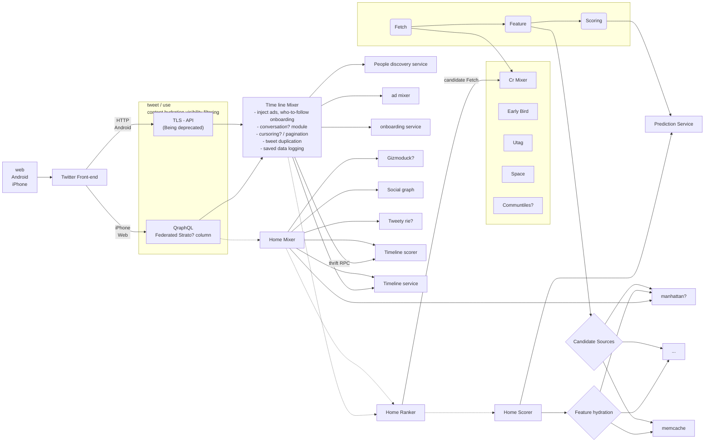

## はじめに

今なにかと話題の twitter ですが、遅いと言われていた Android のアプリについて改善をしようとしているシステム構成図が流れてきました。

https://twitter.com/elonmusk/status/1593899029531803649

内容的に面白いと思い、雑に図に起こして議論の素材を作ろうと思いました。

# システム構成図

不鮮明な箇所が多く、筆者の英語力・技術不足もあって分からない所を？にしています。

* Read path

図の点線の矢印が `next-gen system` と言われている所で今後変更がある所でしょう。
図の作成を `mermaid.js` のフローチャートで書いてしまった ^[mermaid.jsはコンポーネント図の対応がされていない] ので若干わかりづらい点はご了承ください。同じノードが1つに纏まってしまうので、元の図から結構かけ離れてしまいました。 mm

## 最後に

図を書き始めている間に以下の tweet が流れてきました。
https://twitter.com/alexxubyte/status/1594008281340530688

こちらの方が見やすくて良いかと思います w
雑に書いていましたが、大体あっていて良かったです w

あと図をまとめている際に以下の記事を見つけました。
https://blog.twitter.com/engineering/en_us/topics/infrastructure/2020/rebuild_twitter_public_api_2020

もともと GraphQL に統合していこうという流れがあった中で、TLS-API を廃止するぞ！という強い意志が表明されたのと幾つかのモジュールを分割して（Home mixer がそう？）リクエスト数を少なくしてこうという流れなのかなーと思いました。
識者の方のフォローコメントを頂けると嬉しく思います。

[追記]
図に出てくる `Manhattan` は最初わからなかったのですが `real-time, multi-tenant distributed database` だそうです

https://blog.twitter.com/engineering/en_us/a/2014/manhattan-our-real-time-multi-tenant-distributed-database-for-twitter-scale